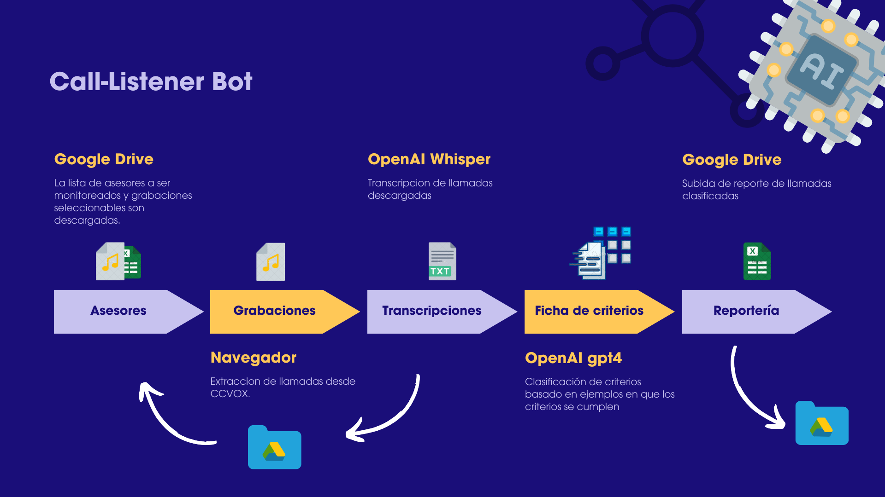

# Call-Listener Bot

## Overview
The Call-Listener Bot automates the monitoring and analysis of sales calls by downloading, transcribing, and analyzing calls based on predefined criteria. The insights are compiled into reports and uploaded for accessibility, facilitating the enhancement of sales advisor strategies.



## Features
- **Automated Downloads:** Retrieves specific advisors' call recordings from Google Drive.
- **Transcription and Analysis:** Transcribes calls using OpenAI Whisper and classifies them via GPT-4 based on compliance with set criteria.
- **Customizable Reporting:** Compiles and uploads detailed analytical reports back to Google Drive.

## Workflow
1. **Data Download:** Downloads advisors' details and call recordings from specified Google Drive folders.
2. **Transcription:** Utilizes OpenAI Whisper for converting audio files into text.
3. **Analysis:** Analyzes transcriptions with GPT-4, checking against defined criteria.
4. **Reporting:** Generates and uploads analytical reports to Google Drive.

## Prerequisites
- Google Drive API with a configured project in Google Cloud Platform (GCP).
- OpenAI API keys for using Whisper and GPT-4 models.
- Access to CCVox or similar systems as needed.

## Setup Instructions
### Google Drive Configuration
- Create a project in GCP and enable the Google Drive API.
- Download the `drive_credentials.json` and place it at the root of the project directory.

### OpenAI Configuration
- Obtain API keys from OpenAI for Whisper and GPT-4.
- Set these keys in the `config.json` configuration file along with Google Drive folder paths and CCVox credentials.

### Installation
```bash
# Clone the repository
git clone https://github.com/ribartra/call-listener_bot.git
# Navigate into the project directory
cd call-listener_bot
# Install the required Python libraries
pip install -r requirements.txt
```

### Configuration File
- Adjust `config.json` to include necessary credentials and paths:
  ```json
  {
    "OPENAI_API_KEY": "...",
    "recorded_calls_drive_folder_id": "...",
    "transcripted_calls_drive_folder_id": "...",
    "analyzed_calls_drive_folder_id": "...",
    "list_of_salesmen": "...",
	"list_of_criteria": "...",
    "ccvox_user": "...",
    "ccvox_password": "...",
	"ccvox_url": "..."
  }

  ```

### Running the Bot
```bash
# Execute the main script
python bot.py
```

## Libraries
This bot uses various Python libraries for file management, data handling, and web scraping, including `os`, `requests`, `json`, `openai`, `pandas`, `nltk`, `selenium`, `googleapiclient`, and others listed in the `requirements.txt` file.

## Adapting the Project
The bot can be adapted to any sequential process and requires detailed definition of criteria: the nature of each criterion, recommendations for compliance, and examples of successful adherence.

## Contributing
Contributions are welcome! Please fork the repository and submit a pull request with your suggested changes or enhancements.

## License
This project is licensed under the MIT License - see the [LICENSE.md](LICENSE.md) file for details.
